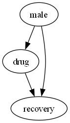
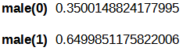
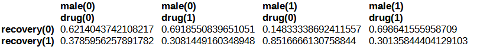
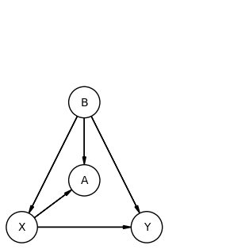
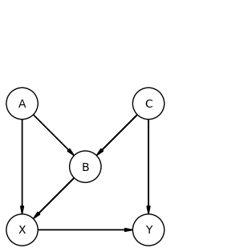
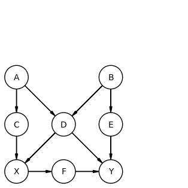

## Backdoor 

When an effect is confounded, one can use pgmpy to calculate the effect of a drug on recovery. Male is the confounder that in the ideal case should influence 'drug' use.

### Code

The imports

`from pgmpy.inference import CausalInference`

`from pgmpy.models import DiscreteBayesianNetwork`

`from pgmpy.factors.discrete.CPD import TabularCPD`

To find the effect of taking a drug on recovery, one first needs to create a causal model.

`causal_model = DiscreteBayesianNetwork([('male', 'drug'), ('male', 'recovery'), ('drug', 'recovery')])`

`causal_model.get_random_cpds(n_states=2, inplace=True, seed=1)`

To create a visual representation of the causal graph

`viz = causal_model.to_graphviz()`

`viz.draw('out/drug_model.png', prog='dot')`

To allow causal inference on the model

`causal_inference = CausalInference(causal_model)`

To find backdoor/frontdoor paths

`bd_adj_sets = causal_inference.get_all_backdoor_adjustment_sets("drug", "recovery")`

`fd_adj_sets = causal_inference.get_all_frontdoor_adjustment_sets("drug", "recovery")`

To infer the effect of drug use on recovery

`do_drug_1 = causal_inference.query(variables=["recovery"], do={"drug": 1}, show_progress=False)`

`do_drug_0 = causal_inference.query(variables=["recovery"], do={"drug": 0}, show_progress=False)`

To retrieve the values

    `print(f"If the drug is taken by everyone p(recovery)={do_drug_1.get_value(recovery=1):.4}")`

    `print(f"If the drug is not taken by anyone p(recovery)={do_drug_0.get_value(recovery=1):.4}")`

### Calculate by hand

Some CPTs

Calculate effect when using drug.

$$P(recovery=1|do(drug=1))= \sum_{male=\{0,1\}}  P(recovery=1|drug=1,male=male) * P(male=male)$$

Calculate effect when not using drug.

$$P(recovery=1|do(drug=0))= \sum_{male=\{0,1\}}  P(recovery=1|drug=0,male=male) * P(male=male)$$

`P(recovery=1|do(drug=1))=((0.649*0.3013)+(0.35*0.3081))=0.3033`

`P(recovery=1|do(drug=0))=((0.649*0.8516)+(0.35*0.3785))=0.6851`

`P(recovery=1|do(drug=1))-P(recovery=1|do(drug=0))=-0.38`

### Adjustment sets

#### Backdoor adjustment

The backdoor criterion is a set of conditions that, when satisfied, allow for adjustment of confounding variables to estimate the causal effect. The backdoor adjustment method involves controlling for all variables that are causes of both the treatment and the outcome. This method essentially blocks the association between the treatment and the outcome through controlling for a common cause, or a confounding variable.

#### Frontdoor adjustment

The frontdoor criterion identifies a mediator variable that lies on the causal pathway between the treatment and the outcome. Adjustment for the mediator variable allows for estimation of the direct effect of the treatment on the outcome, rather than the total effect. The frontdoor adjustment method is typically used in situations where the mediator is easier to measure or manipulate than the confounding variable, or where the confounding variable cannot be measured directly.

For the graph below:

The backdoor adjustment sets are {B}, meaning B will have to be taken into account when calculating the effect of X on Y.

The backdoor adjustment sets are {A,B} and {C}, meaning {A, B} or {C} will have to be taken into account when calculating the effect of X on Y.

### Another case:

For the graph below

The frontdoor adjustment set is {F}

To calculate the effect of X on Y, F needs to be accounted for to get an unbiased estimate of the effect of X on Y.

F meets all the frontdoor criteria:
- F intercepts all direct paths from X to Y
- There are no unblocked paths from X to F
- All backdoor paths from F to Y are blocked by X

So the frontdoor adjustment can be applied by controlling for the variable F.

#### Effect of X on F

To estimate the effect of X on F the following formula is used.

$$ P(F|do(X))= \sum_{backdoors} P(F|X, backdoors)*backdoors= P(F|X)$$

As there are no backdoors this formula can be reduced to

$$P(F|do(X))= P(F|X)$$

#### Effect of F on Y

For each value of F, its effect is accounted for

$$P(Y|do(F))=\sum_{X} P(Y|F,X)*P(X)$$

#### Total effect

X' is used for notational clarity

$$P(Y|do(X))=\sum_{F}P(F|X)\sum_{X'}P(Y|F,X')*P(X')$$

$$P(Y|do(X))=P(F=0|X=1)\sum_{X'}P(Y|F,X')*P(X')+P(F=1|X=1)\sum_{X'}P(Y|F,X')*P(X')$$

$$P(Y|do(X))=0.50047765\sum_{X'}P(Y|F,X')*P(X')+0.49952234\sum_{X'}P(Y|F,X')*P(X')$$

X=1
P(F=0)=0.50047765
P(F=1)=0.49952234

F(0) => Y(0) 0.56316796
F(0) => Y(1) 0.43683204
F(1) => Y(0) 0.5104059075
F(1) => Y(1) 0.4895940925 

